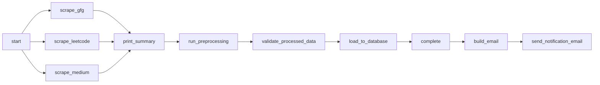
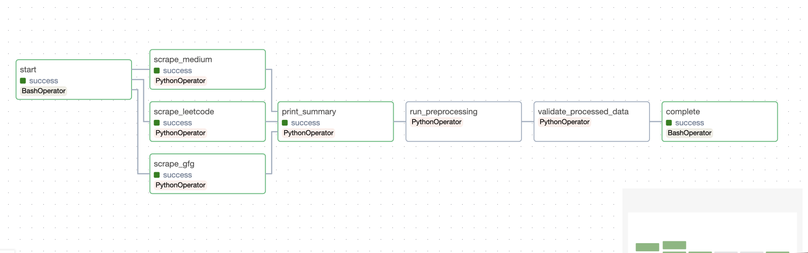
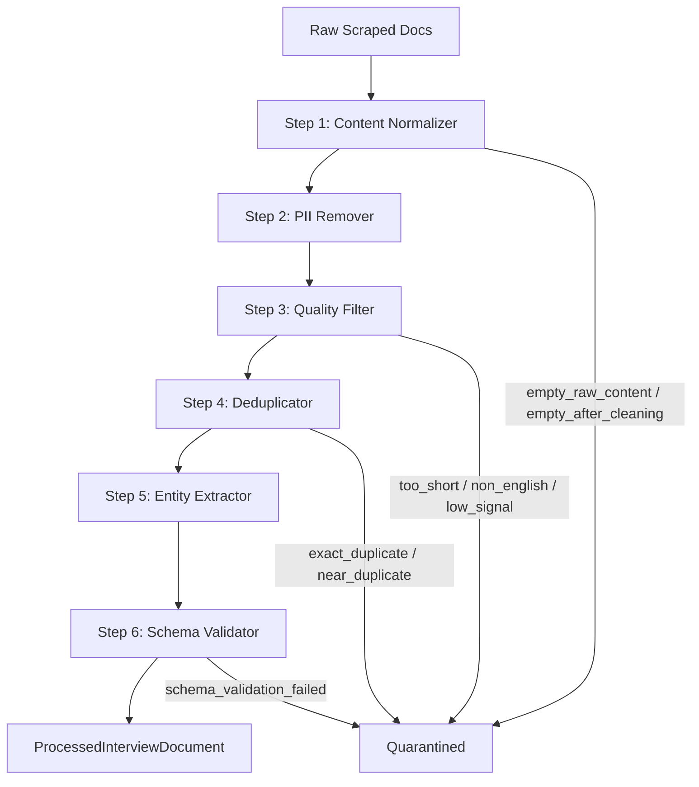

# Data Pipeline Documentation

## 1. Airflow DAGs

### DAG: `interview_scraping_pipeline`

| Property | Value |
|---|---|
| **DAG ID** | `interview_scraping_pipeline` |
| **Schedule** | `None` (manually triggered) |
| **Catchup** | `False` |
| **Start Date** | 2024-01-01 |
| **Tags** | `scraping`, `preprocessing`, `database`, `bulk`, `production` |

### Task Dependency Graph




### Task Details

| Task ID | Operator | What It Does |
|---|---|---|
| `start` | `BashOperator` | Logs pipeline start timestamp |
| `scrape_gfg` | `PythonOperator` | Runs GFG bulk scraper |
| `scrape_leetcode` | `PythonOperator` | Runs LeetCode bulk scraper |
| `scrape_medium` | `PythonOperator` | Runs Medium bulk scraper |
| `print_summary` | `PythonOperator` | Aggregates scraper stats via XCom |
| `run_preprocessing` | `PythonOperator` | Runs the 6-step preprocessing pipeline; resumes on retry |
| `validate_processed_data` | `PythonOperator` | Cross-checks GCS blob counts against pipeline report |
| `load_to_database` | `PythonOperator` | Upserts processed docs into PostgreSQL |
| `complete` | `BashOperator` | Logs pipeline completion timestamp |
| `build_email` | `PythonOperator` | Builds HTML email body with full run stats |
| `send_notification_email` | `EmailOperator` | Sends status email to the team |

### Key Design Decisions

- **Parallel scraping** — The three scraper tasks fan out from `start` and run in parallel, then converge at `print_summary`. This keeps the total scraping time close to the slowest scraper rather than the sum of all three.
- **Resume on retry** — `run_preprocessing` checks `try_number > 1` and passes `resume=True` to the pipeline, so it picks up from the last checkpoint instead of re-running everything from scratch.
- **Email on all outcomes** — `build_email` and `send_notification_email` use `trigger_rule='all_done'`, which means the team gets notified whether the pipeline succeeded or failed.
- **XCom metrics passing** — Scraper stats, preprocessing counts, and DB load results are all pushed/pulled via XCom to build a comprehensive summary email at the end.
- **Batch ID convention** — Derived from Airflow's `logical_date` as `YYYY-MM-DD_bulk`, giving us a consistent key to use across GCS paths and reports.

---

## 2. Data Acquisition

The pipeline scrapes interview experiences from three platforms, each requiring a different strategy based on how the source exposes its data. All scrapers share a common interface — they accept a `StorageBackend`, produce `ScrapedInterviewDocument` objects, and write a `Manifest` when done.

### Scraper Summary

| Scraper | Source | Output Path |
|---|---|---|
| `GFGScraper` | GeeksforGeeks | `raw/{batch_id}/gfg/` |
| `LeetCodeScraper` | LeetCode Discuss | `raw/{batch_id}/leetcode/` |
| `MediumScraper` | Medium | `raw/{batch_id}/medium/` |

---

### GeeksforGeeks (`src/scrapers/gfg.py`)

GFG has a well-structured sitemap, so we lean on that rather than crawling HTML pages blindly.

1. **Sitemap discovery** — Fetches the sitemap index, filters down to `post/` sitemaps only.
2. **Date filtering** — In bulk mode, keeps sitemaps with `lastmod >= 2025-01-01`. In incremental mode, reads the last manifest's watermark and only processes newer sitemaps.
3. **URL extraction** — Parses each sitemap, filters URLs matching an interview-experience regex pattern, deduplicates, and applies date cutoffs.
4. **Article scraping** — For each URL, fetches the page via `requests`, parses it with BeautifulSoup to pull out the title, article body (from the `article--viewer` div), published date, and tags.
5. **Dedup before fetch** — Checks if the document already exists in GCS before making the HTTP request.

Metadata extracted includes tags and experience type classification (on-campus, off-campus, internship) based on tag and title analysis.

---

### LeetCode (`src/scrapers/leetcode.py`)

LeetCode doesn't offer sitemaps for discussion posts, but it does expose a GraphQL API — so we use that directly.

1. **Post listing** — Sends the `discussPostItems` query with `tagSlugs: ["interview"]`, paginating in batches of 50 until all posts are fetched.
2. **Detail fetch** — For each listed post, sends `discussPostDetail` to get the full content body. Progress is checkpointed every 20 posts.
3. **Optional comments** — If enabled, fetches up to 5 pages of comments per post via `questionDiscussComments`.
4. **Company extraction** — Two-tier approach: first checks post tags for `tagType == "COMPANY"`, then falls back to title matching against a curated list of 60+ known companies.
5. **Content cleaning** — Strips HTML tags, collapses whitespace, validates minimum content length.

The GraphQL queries are defined in `src/scrapers/configs/leetcode.py` — they were captured from browser DevTools and include pagination fields, tag data, and reaction counts.

---

### Medium (`src/scrapers/medium.py`)

Medium is the trickiest source — it uses heavy client-side rendering and aggressive bot detection. We handle this with Playwright.

1. **Sitemap fetch** — Uses Playwright to download Medium's sitemap index (which sometimes triggers a download prompt instead of rendering inline).
2. **URL collection** — Extracts article URLs from each sitemap, filters for the keyword `interview-experience`.
3. **HTML fetch** — Launches headless Chromium with a realistic fingerprint (user agent, 1920×1080 viewport, locale, timezone) and navigates to each article.
4. **Content extraction** — This is where it gets interesting. We use a multi-strategy approach:
   - **Primary**: Parse Medium's embedded `__APOLLO_STATE__` JSON to extract paragraphs, then reconstruct Markdown with proper headings, blockquotes, and code blocks.
   - **Fallback chain**: `<article>` tag → `postArticle` class → `<main>` tag → raw paragraph extraction.
5. **Paywall detection** — Checks multiple signals: `meteredContent` CSS class, "Member-only story" text, JSON-LD `isAccessibleForFree`, Apollo State `isLocked` flags, and upgrade/subscribe CTAs. Paywalled articles are skipped.
6. **Metadata** — Pulls description, reading time, tags (from Apollo State), featured image, and canonical URL.

Errors are categorized (HTTP 4xx/5xx, timeouts, connection errors) with separate counters for each category. A dedicated log file is written to `{log_dir}/medium_scraper_{batch_id}.log`.

---

### Common Patterns Across All Scrapers

- **`StorageBackend` abstraction** — All I/O goes through the storage interface, no direct filesystem calls.
- **Dedup before fetch** — Each scraper calls `storage.file_exists()` before making network requests, avoiding re-scraping within the same batch.
- **`ScrapedInterviewDocument` output** — Uniform schema with `document_id` generated as `{platform}_{SHA256(url)[:6]}`.
- **Manifest creation** — Every scraper writes a manifest to `manifests/{batch_id}/{platform}/scrape_{date}.json` with stats and watermarks for incremental mode.
- **Batch ID convention** — `{YYYY-MM-DD}_{bulk|weekly}`.

---

## 3. Data Preprocessing

### How It Works

Raw scraped documents go through **6 sequential steps** before they're ready for the database. Each step implements the `PreprocessingStep` abstract base class, which provides a `run_batch()` harness that handles per-document error isolation, timing, and metrics collection. If a step wants to drop a document, it sets `doc["_filter_reason"]` and returns `None` — the base class tallies these up automatically.

All configuration (regex patterns, keyword lists, thresholds) lives in YAML files under `src/preprocessing/resources/`.

### Pipeline Flow



### Step 1: Content Normalizer (`content_normalizer.py`)

Takes raw scraped HTML/Markdown and turns it into clean, uniform plain text. The pipeline inside this step runs: encoding fixes → HTML stripping (BeautifulSoup) → Markdown removal → boilerplate removal (platform-specific patterns first, then generic) → emoji removal → Unicode NFC normalization → whitespace standardization.

All regex patterns are loaded from `normalization_patterns.yaml`.

**Input:** `raw_content`, `title`, `source_platform`
**Output:** `preprocessing.content_normalizer.content`, `.title`, `.word_count`
**Can filter:** Yes — drops docs with empty content or content shorter than 20 chars after cleaning.

### Step 2: PII Remover (`pii_remover.py`)

Scrubs personally identifiable information using regex patterns loaded from `pii_patterns.yaml`. Replaces emails with `[EMAIL]`, phone numbers with `[PHONE]`, personal URLs with `[PERSONAL_URL]`, etc.

This step **never filters** — every document passes through, just with PII redacted. It also tracks counts of each PII type found (e.g., `{"email": 2, "phone": 1}`).

**Input:** `preprocessing.content_normalizer.content`, `.title`
**Output:** `preprocessing.pii_remover.content`, `.title`, `.pii_counts`

### Step 3: Quality Filter (`quality_filter.py`)

Drops documents that aren't worth processing further. Checks run cheapest-first to fail fast:

1. **Word count bounds** — Too short (default < 50 words) or too long (> 15,000 words).
2. **Error page detection** — Regex match on first 500 chars for "404 Not Found", "Access Denied", etc.
3. **Language detection** — Uses `langdetect`; rejects non-English content. Short texts skip detection since `langdetect` is unreliable on small samples.
4. **Interview signal ratio** — Checks what fraction of words are interview-relevant ("interview", "round", "offer", "coding", etc.). Below 2% → likely off-topic.

Documents that pass get a `quality_score` (0.0–1.0) based on length and signal density, attached for downstream ranking.

### Step 4: Deduplicator (`deduplicator.py`)

Two-tier deduplication to catch both identical and near-identical documents across platforms.

**Tier 1 — Exact:** SHA-256 hash on normalized (lowercased, whitespace-collapsed) content. O(1) lookup. Catches verbatim reposts and scraper double-fetches.

**Tier 2 — Near:** MinHash signatures with Locality-Sensitive Hashing. Catches paraphrased cross-posts where someone posted the same experience on multiple platforms with minor edits. Configurable via `dedup_configs.yaml` — default similarity threshold is 0.80, using 128 permutations and 3-word shingles.

The dedup state persists across batches: exact hashes are seeded from the DB at pipeline start, and the LSH index can be serialized to disk via `save_state()`.

### Step 5: Entity Extractor (`entity_extractor.py`)

Extracts 8 structured fields from the cleaned content using regex patterns, curated dictionaries, and spaCy NER. This step **never filters** — every document passes through, enriched with whatever could be extracted.

| Entity | How It's Extracted |
|---|---|
| **Company** | 3-tier: title regex → alias dictionary → spaCy ORG NER (on title + first 500 chars) |
| **Role** | 3-tier: title regex with level suffix → context phrases ("for the role of...") → alias scan. Roman numerals normalized to digits. |
| **Experience Level** | Keyword match (`intern`, `senior`, `staff`, etc.) |
| **Interview Types** | Keyword match; returns a list since one experience can mention multiple types |
| **Num Rounds** | Max of explicit count ("3 rounds") vs unique round header markers ("Round 1", "HR Round") |
| **Topics** | Pre-compiled regex per category (DSA, system design, behavioral, ML, SQL, etc.) |
| **Outcome** | Keyword match; checks the last 30% of text first (where outcomes are usually stated) |
| **Difficulty** | Keyword match for explicit difficulty language |

All patterns and dictionaries are in `entity_extraction.yaml`. The spaCy model is lazy-loaded on first use with only the NER pipe enabled.

### Step 6: Schema Validator (`schema_validator.py`)

The final gate. Maps the enriched doc dict to `ProcessedInterviewDocument` constructor kwargs and tries to construct it. All validation lives inside the dataclass's `__post_init__` — required field checks, platform alias normalization (`gfg` → `geeksforgeeks`), safe-enum coercion (invalid values → `None`), and interview type filtering.

If construction succeeds, you get a frozen dataclass ready for the database. If it fails, the doc gets a `_filter_reason` and gets quarantined for manual review.

---

## 4. Schema Validation & Statistics

### Data Models (`src/data_models/`)

#### `ScrapedInterviewDocument`

The raw document emitted by scrapers — minimal validation, no normalization. Downstream preprocessing handles all the cleaning.

| Field | Type | Description |
|---|---|---|
| `document_id` | `str` | Stable ID: `{platform}_{SHA256(url)[:6]}` |
| `source_platform` | `str` | Raw platform string |
| `source_url` | `str` | Original URL |
| `title` | `str` | Page title |
| `raw_content` | `str` | Full scraped text |
| `published_at` | `Optional[str]` | Publication date if available |
| `scraped_at` | `str` | ISO 8601 timestamp |
| `scrape_type` | `str` | `bulk` or `incremental` |
| `scrape_batch_id` | `str` | Links to the Airflow run |
| `source_metadata` | `Dict` | Platform-specific extras (tags, votes, etc.) |

#### `ProcessedInterviewDocument`

The fully validated document ready for DB insertion. Validation happens in `__post_init__` — construction *is* the validation gate.

Key validation rules: required fields must be non-empty, platform names are alias-normalized, enum fields use safe coercion (invalid → `None`), interview types are filtered to the valid set, and `preprocessed_at` is auto-set if not provided.

Valid enum values:
- **experience_level**: `intern`, `entry`, `mid`, `senior`, `staff`, `leadership`, `unknown`
- **interview_outcome**: `offer`, `reject`, `pending`, `unknown`
- **difficulty**: `easy`, `medium`, `hard`, `unknown`
- **interview_types**: `phone_screen`, `onsite`, `online_assessment`, `virtual`, `on_campus`, `off_campus`, `walk_in`

#### `PreprocessingPipelineReport`

Written to GCS as `processed/{batch_id}_report.json` after each pipeline run. Contains `batch_id`, start/end timestamps, duration, input/output counts, per-step results, quarantine count, and status (`pending` | `completed` | `failed`).

#### `DBLoadReport`

Generated after each `BatchDBLoader.load_batch()` call and stored in `gs://{bucket}/db-report/`. Tracks total/inserted/skipped counts, plus lists of successful inserts, read errors, and insert errors with paths and messages.

#### `Manifest`

Tracks scraping run metadata. Supports incremental scraping via `last_sitemap_lastmod` watermark. Key methods: `save()`, `load()`, `get_latest()` — all operate through the `StorageBackend` abstraction.

---

## 5. Anomaly Detection & Alerts

### Count Mismatch Detection

After preprocessing completes, the `validate_processed_data` Airflow task does a three-way check:

1. Compares the pipeline's reported output count (via XCom) against the actual GCS blob count under `processed/{batch_id}/`.
2. Verifies the pipeline report JSON exists.
3. Fails if zero processed files are found.

Any mismatch raises `AirflowFailException` with a descriptive error message.

### Quarantine Logic

Documents that fail schema validation aren't silently dropped. The pipeline orchestrator splits them out via `_separate_quarantined()` and writes them to `gs://{bucket}/quarantine/{batch_id}/{reason}/{document_id}.json` for manual review. The preprocessing report tracks `quarantined_count` alongside `output_count`.

### Per-Document Filter Tracking

Every preprocessing step that can drop a document sets `doc["_filter_reason"]` before returning `None`. The base class aggregates these into `StepResult.filter_reasons`:

| Step | Possible Filter Reasons |
|---|---|
| Content Normalizer | `empty_raw_content`, `empty_after_cleaning` |
| Quality Filter | `too_short_{n}_words`, `too_long_{n}_words`, `error_or_junk_page`, `non_english`, `low_interview_signal` |
| Deduplicator | `exact_duplicate`, `near_duplicate`, `empty_content_at_dedup` |
| Schema Validator | `schema_validation_failed: {detail}` |

### Email Alerting

The `build_email` task (trigger rule: `all_done`) constructs an HTML report with scraping counts, preprocessing stats, DB load results, and a list of any failed tasks. `send_notification_email` delivers it to the team regardless of pipeline outcome.

---

## 6. Pipeline Orchestrator

### `PreprocessingPipeline` (`src/preprocessing/pipeline.py`)

The orchestrator owns the **flow**; individual steps own their **logic**.

| Responsibility | How It Works |
|---|---|
| Load raw docs | Scans `raw/{batch_id}/{platform}/` for all 3 platforms |
| Build step chain | Reads `pipeline_config.yaml`, skips disabled steps, resolves from `_STEP_REGISTRY` |
| Execute steps | Iterates through steps, calling `step.run_batch(docs)` and collecting `StepResult` per step |
| Checkpointing | Saves intermediate JSONL + `_meta.json` to GCS after configured steps |
| Resume on retry | Loads last checkpoint and skips ahead (`_resolve_start()`) |
| Quarantine | Splits valid docs from those with `_quarantine_reason` |
| Output | Valid docs → `processed/{batch_id}/{doc_id}.json`; quarantined → `quarantine/{batch_id}/{reason}/{doc_id}.json` |
| Reporting | Writes `PreprocessingPipelineReport` to `manifests/{batch_id}/preprocessing_report.json` |

### Checkpoint Manager

Persists pipeline state to GCS so we can recover from crashes without re-running expensive steps:

```
checkpoints/{batch_id}/{step_name}.jsonl   ← document data
checkpoints/{batch_id}/_meta.json          ← {"last_completed_step": "...", "doc_count": N}
```

On resume, the pipeline reads `_meta.json`, loads the corresponding JSONL, and continues from the next step. Checkpoints are cleaned up on successful completion.

### Step Registry (`src/preprocessing/registry.py`)

A simple `Dict[str, type]` mapping step names to classes. Steps register themselves in `src/preprocessing/steps/__init__.py`. No if/elif chains — new steps plug in with a single registration call.

---

## 7. Database Loader

### How It Works (`src/database/`)

The database layer does **idempotent upserts** into PostgreSQL (Cloud SQL), writing to two tables: `processed_documents` and `interview_metadata`.

### `BatchDBLoader` (`loader.py`)

Reads processed JSON files from GCS in configurable chunks (default 50), deserializes them into `ProcessedInterviewDocument` objects, and upserts each one. Both SQL statements use `ON CONFLICT (document_id) DO UPDATE`, so re-runs are always safe.

For company and role lookups, the loader uses **get-or-create** semantics with in-memory caches (`INSERT ... ON CONFLICT ... RETURNING id`). One bad document doesn't block the batch — there's a per-row try/catch with `conn.rollback()` on failure.

The return value is a summary dict with `total`, `inserted`, `skipped`, `success` (list), `failed_reads` (list), and `failed_inserts` (list).

### SQL Queries (`queries.py`)

Two parameterized upsert statements with PostgreSQL typed casts:

- **`UPSERT_PROCESSED_DOC`** — Inserts into `processed_documents` with casts for `source_platform_enum` and `jsonb`; on conflict updates content hash, cleaned content, word count, processed timestamp, and metadata.
- **`UPSERT_INTERVIEW_META`** — Inserts into `interview_metadata` with typed casts for experience level, outcome, difficulty, interview type, and topics (`text[]`); on conflict updates all metadata fields.

### Sanitizers (`sanitizers.py`)

Maps Python model values to valid PostgreSQL enum values right before insertion. The key thing: the Python model allows `"unknown"` for several fields, but the DB enums don't include it — so the sanitizer converts `"unknown"` to `NULL`. Also handles the `"geeksforgeeks"` → `"gfg"` platform mapping.

---

## 8. Storage Backend

### Architecture (`src/storage/`)

Everything in the project reads and writes files through the `StorageBackend` abstract base class. This makes it easy to swap implementations (GCS in production, in-memory dict in tests).

The interface defines four methods: `write_json()`, `read_json()`, `file_exists()`, and `list_files()`. All paths are relative.

### `GCSBackend` (`gcs_backend.py`)

The production implementation. Authenticates via Google Secret Manager (recommended) or environment default credentials. On init, it verifies the bucket exists and cleans up temporary key files on failure or garbage collection.

Key behaviors: `write_json()` uploads with `application/json` content type and `indent=2`; `read_json()` checks blob existence before downloading; `list_files()` returns results sorted newest-first.

```python
# Production (Secret Manager auth)
storage = GCSBackend(
    bucket_name="interviewprep-ai-data",
    project_id="professorbot-dovbsg",
    secret_name="gcs-service-account-key",
)

# CI/CD (env var auth)
storage = GCSBackend(bucket_name="interviewprep-ai-data")
```

---

## 9. Tracking & Logging

### Python Logger Setup

The pipeline uses Python's standard `logging` module with a hierarchical namespace:
- `interviewprep.dag` — DAG-level logging
- `preprocessing.pipeline` — Pipeline orchestrator
- `preprocessing.{step_name}` — Per-step logging (each step gets its own logger via the base class)

The Medium scraper sets up dual handlers: a file handler with full verbosity and a console handler at WARNING level.

### XCom Metrics

Scraper stats, preprocessing counts (`preprocess_status`, `preprocess_input_count`, `preprocess_output_count`, `preprocess_duration_seconds`), and DB load results (`db_inserted`, `db_skipped`) are all passed between tasks via Airflow XCom. The `build_email` task pulls from all upstream tasks to construct the summary.

### Accessing Logs

- **Airflow UI** — Click on any task instance to view its logs.
- **GCS reports** — Preprocessing reports at `manifests/{batch_id}/preprocessing_report.json`; DB load reports at `db-report/db_load_{timestamp}.json`.
- **Medium scraper** — Dedicated log file at `{log_dir}/medium_scraper_{batch_id}.log`.

---

## 10. Pipeline Optimization

### Parallel Scraper Execution

The three scrapers run in parallel after the `start` task. This means total scraping time ≈ max(GFG, LeetCode, Medium) rather than the sum.

```mermaid
gantt
    title Pipeline Execution Timeline
    dateFormat HH:mm
    axisFormat %H:%M

    section Scraping (parallel)
    GFG Scraper        :s1, 00:00, 4h
    LeetCode Scraper   :s2, 00:00, 2h
    Medium Scraper     :s3, 00:00, 6h

    section Sequential
    Summary            :after s1 s2 s3, 5m
    Preprocessing      :4h
    Validation         :10m
    DB Load            :2h
    Email              :5m
```



### Checkpointing Strategy

Expensive steps (like dedup and entity extraction) can be configured for checkpointing in `pipeline_config.yaml`. After each checkpointed step, the pipeline writes intermediate results as JSONL to GCS. On crash and retry, it resumes from the last checkpoint instead of starting over — this is especially valuable for the 4-hour preprocessing window.

### Performance Considerations

- **Dedup before fetch** — All scrapers check GCS before making network requests, avoiding redundant downloads.
- **Batch processing** — The DB loader processes files in configurable chunks (default 50) to balance memory usage and commit frequency.
- **In-memory caches** — Company and role lookups are cached in-memory with warm-start from DB, reducing per-row query overhead.
- **Lazy model loading** — The spaCy model is only loaded when the EntityExtractor first needs it, not at import time.

---

## 11. Error Handling

Error handling is layered at each level of the pipeline:

### Scraper Level

- **Per-URL try/catch** — All three scrapers wrap individual URL fetches in try/catch blocks. A failed article doesn't stop the batch.
- **Rate limit handling** — LeetCode retries after 60s on HTTP 429; Medium sleeps for 30s; GFG uses a fixed 3s delay between requests.
- **Categorized error tracking** — Medium tracks 8 error categories separately (HTTP 4xx variants, timeouts, connection errors, parse errors). All scrapers maintain error counts and error URL/ID lists in their stats.
- **Dedup before fetch** — Checking GCS before downloading prevents wasted network calls on already-scraped content.

### Preprocessing Level

- **Per-document isolation** — The `run_batch()` harness catches exceptions per document. One bad doc doesn't take down the batch.
- **Filter reason tracking** — Every dropped document gets a `_filter_reason` explaining why it was removed.
- **Quarantine, don't delete** — Documents that fail schema validation are written to a separate GCS path for manual review rather than being silently discarded.
- **Checkpoint-based recovery** — On crash and retry, the pipeline resumes from the last checkpoint rather than re-processing everything.

### Database Level

- **Idempotent writes** — Both SQL statements use `ON CONFLICT DO UPDATE`, making every write operation safe to retry.
- **Per-row error isolation** — If one document fails to insert, the connection rolls back for that row and continues with the next. Failed inserts are tracked in `failed_inserts` with document ID and error message.
- **Get-or-create with caching** — Company and role lookups use `INSERT ... ON CONFLICT ... RETURNING id` to avoid race conditions, with in-memory caches to minimize DB round-trips.
- **Zero-insert detection** — The Airflow task raises `AirflowFailException` if zero documents were inserted out of a non-empty batch.

## 12. Data Versioning Control (DVC)

Instead of using DVC, our project implements a **GCS-native batch versioning strategy** that is tightly integrated with our Airflow-orchestrated, cloud-native architecture. This approach achieves the same core goals — reproducibility, traceability, rollback, and data lineage — without introducing an external tool that was designed for local-first workflows.

### How It Works

Every Airflow DAG execution generates a unique **batch ID** derived from the execution date:

```python
batch_id = f"{execution_date.strftime('%Y-%m-%d')}_bulk"
# Example: 2026-02-22_bulk
```

This batch ID acts as the **version tag** for all data produced in that run — raw files, processed outputs, reports, and checkpoints are all namespaced under it.

### Versioned Storage Layout

```
gs://interviewprep-ai-data/
├── raw/{batch_id}/gfg/              # Scraped data per source
├── raw/{batch_id}/leetcode/
├── raw/{batch_id}/medium/
├── manifests/{batch_id}/            # Scraper manifests with URL hashes & watermarks
├── processed/{batch_id}/            # Processed documents (immutable per batch)
├── processed/{batch_id}_report.json # Pipeline report — input/output counts, duration, step results
├── quarantine/{batch_id}/           # Failed documents for manual review
├── checkpoints/{batch_id}/          # Intermediate state for crash recovery
└── db-report/                       # Database load reports with insert/skip counts
```

Each batch creates a **separate versioned folder** — data is never overwritten. Every historical version is preserved and directly accessible in GCS.

### Why This Works Better Than DVC for Our Use Case

| Requirement | DVC | Our Approach |
|---|---|---|
| **Version tracking** | `.dvc` pointer files in Git | Batch ID folders in GCS (`2026-02-22_bulk/`) |
| **Remote storage** | Requires `dvc remote add` config | Native GCS — already our primary storage |
| **Reproducibility** | `dvc repro` reruns stages | Re-trigger DAG with same `logical_date` |
| **Data lineage** | `dvc.lock` records stage hashes | Manifest files + pipeline reports per batch |
| **Rollback** | `dvc checkout <rev>` | Access any batch folder directly in GCS |
| **Deduplication** | Content-addressable cache | Content hashing in scraper manifests |
| **Integrity validation** | Not built-in | Automated `validate_processed_data` task in DAG |
| **Automation** | Manual `dvc add` / `dvc push` | Fully automated — every DAG run versions data |

### Key Advantages

1. **Zero additional tooling** — No extra CLI to install or maintain. Versioning is built into the pipeline itself.
2. **Cloud-native** — Our data never touches a local filesystem. It flows directly between cloud services (scrapers → GCS → PostgreSQL). DVC's local-remote sync model would be redundant.
3. **Fully automated** — DVC requires manual `dvc add` and `dvc push` after data changes. Our versioning happens automatically on every pipeline run.
4. **Built-in validation** — The `validate_processed_data` task verifies data integrity (count matching, report existence) as part of the DAG. DVC has no equivalent automated check.
5. **Manifest-level lineage** — Scraper manifests track every URL, its content hash, and scrape timestamp. Combined with pipeline reports, we can trace any processed document back to its exact raw source and the pipeline run that produced it.
6. **Team-friendly** — Any team member can browse or retrieve any data version directly in GCS without needing DVC installed or configured locally.

### Why GCS-Native Versioning Is Better Than DVC for Our Project

DVC was built for a fundamentally different workflow — one where a data scientist works locally, runs experiments on their machine, and then pushes data snapshots to a remote. Our project doesn't follow that pattern at all.

**Our pipeline is fully cloud-based and automated.** Scrapers run on a GCE VM, data lands directly in GCS, preprocessing happens in Airflow, and results go straight to Cloud SQL. At no point does data exist on a local machine. DVC would force us to introduce a local-remote sync step that serves no purpose in this architecture — we'd be pulling data from GCS to the VM just to run `dvc add`, then pushing it right back to GCS.

**DVC tracks data at the file level; we track at the pipeline-run level.** DVC creates a hash per file and stores it in a `.dvc` pointer file. This is useful when individual files change independently. In our case, an entire batch of documents is always produced, processed, and validated together as a unit. The batch ID naturally groups all related artifacts — raw files, processed outputs, reports, quarantine — under one version. Tracking individual file hashes adds granularity we don't need and complexity we don't want.

**DVC requires manual intervention; our versioning is zero-touch.** After every scraping run, someone would need to run `dvc add data/raw`, `dvc add data/processed`, `git add *.dvc`, `git commit`, and `dvc push`. In a team of 6, this is error-prone — one forgotten `dvc push` and the version history is broken. Our approach versions data automatically on every DAG execution. No human in the loop means no human error.

**DVC's `.dvc` files create unnecessary Git noise.** Every time data changes, DVC modifies the `.dvc` pointer files, which need to be committed to Git. For a pipeline that runs frequently, this pollutes the Git history with commits that contain no meaningful code changes — just updated hashes. Our approach keeps Git clean for code and lets GCS handle data history natively.

**Rollback with DVC requires Git gymnastics; ours is a direct GCS lookup.** To roll back to a previous data version with DVC, you need to `git checkout` the old `.dvc` files and then `dvc checkout` to restore the data. With our approach, previous versions are always available at `processed/2026-02-20_bulk/` — no checkout, no restore, just a direct path.

**Our validation is stronger.** DVC assumes that if the hash matches, the data is intact. Our `validate_processed_data` task goes further — it cross-checks document counts between the pipeline report and actual GCS blobs, verifies report existence, and fails the DAG if anything is off. This catches issues that hash-based tracking alone would miss, like partial uploads or orphaned files.

In summary, DVC would add configuration overhead, manual steps, and Git complexity to a pipeline that already handles versioning, lineage, and integrity validation natively. Our GCS-native approach is simpler, fully automated, and purpose-built for the cloud-first architecture we operate in.