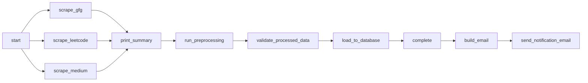
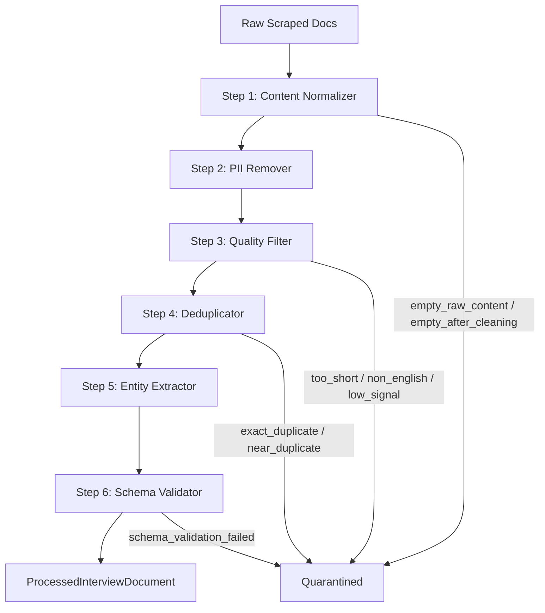

# InterviewPrep-AI

## 1. Project Overview

InterviewPrep-AI is an end-to-end data engineering pipeline that scrapes interview experiences from three major platforms — **GeeksforGeeks**, **LeetCode**, and **Medium** — preprocesses the raw data through a multi-step transformation pipeline, validates output integrity, and loads the cleaned documents into a PostgreSQL database. The whole thing is orchestrated by **Apache Airflow**, with raw and processed artifacts stored in **Google Cloud Storage (GCS)**. After every run, the team gets an email report with the full pipeline status.

---

## 2. Airflow DAGs

### DAG: `interview_scraping_pipeline`

| Property | Value |
|---|---|
| **DAG ID** | `interview_scraping_pipeline` |
| **Schedule** | `None` (manually triggered) |
| **Catchup** | `False` |
| **Start Date** | 2024-01-01 |
| **Tags** | `scraping`, `preprocessing`, `database`, `bulk`, `production` |

### Task Dependency Graph



### Task Details

| Task ID | Operator | What It Does |
|---|---|---|
| `start` | `BashOperator` | Logs pipeline start timestamp |
| `scrape_gfg` | `PythonOperator` | Runs GFG bulk scraper |
| `scrape_leetcode` | `PythonOperator` | Runs LeetCode bulk scraper |
| `scrape_medium` | `PythonOperator` | Runs Medium bulk scraper |
| `print_summary` | `PythonOperator` | Aggregates scraper stats via XCom |
| `run_preprocessing` | `PythonOperator` | Runs the 6-step preprocessing pipeline; resumes on retry |
| `validate_processed_data` | `PythonOperator` | Cross-checks GCS blob counts against pipeline report |
| `load_to_database` | `PythonOperator` | Upserts processed docs into PostgreSQL |
| `complete` | `BashOperator` | Logs pipeline completion timestamp |
| `build_email` | `PythonOperator` | Builds HTML email body with full run stats |
| `send_notification_email` | `EmailOperator` | Sends status email to the team |

### Key Design Decisions

- **Parallel scraping** — The three scraper tasks fan out from `start` and run in parallel, then converge at `print_summary`. This keeps the total scraping time close to the slowest scraper rather than the sum of all three.
- **Resume on retry** — `run_preprocessing` checks `try_number > 1` and passes `resume=True` to the pipeline, so it picks up from the last checkpoint instead of re-running everything from scratch.
- **Email on all outcomes** — `build_email` and `send_notification_email` use `trigger_rule='all_done'`, which means the team gets notified whether the pipeline succeeded or failed.
- **XCom metrics passing** — Scraper stats, preprocessing counts, and DB load results are all pushed/pulled via XCom to build a comprehensive summary email at the end.
- **Batch ID convention** — Derived from Airflow's `logical_date` as `YYYY-MM-DD_bulk`, giving us a consistent key to use across GCS paths and reports.

---

## 3. Folder Structure

The repository is structured to separate orchestration, core logic (`src`), testing, and configuration. 

```text
interviewprep-ai/
├── .venv/                              # Python virtual environment
├── dags/                               # Airflow DAGs directory
│   └── scraping_pipeline.py            # Main orchestration DAG for the pipeline
├── src/                                # Main source code directory
│   ├── data_models/                    # Data schemas and Pydantic/dataclass models
│   │   ├── __init__.py                 # Package initialization
│   │   ├── db_load_report.py           # Model representing the database load summary report
│   │   ├── preprocessed_document.py    # Schema for cleaned and transformed documents
│   │   ├── preprocessing_report.py     # Model tracking preprocessing success/failure stats
│   │   ├── scraped_document.py         # Schema for raw documents parsed by scrapers
│   │   └── scraping_manifest.py        # Model tracking scraper execution runs and state
│   ├── database/                       # Database interaction layer
│   │   ├── __init__.py                 # Package initialization
│   │   ├── loader.py                   # Handles bulk inserts of processed data to PostgreSQL
│   │   ├── queries.py                  # SQL query definitions
│   │   └── sanitizers.py               # SQL injection prevention and data sanitation utils
│   ├── preprocessing/                  # Data transformation and cleaning pipeline
│   │   ├── resources/                  # Preprocessing YAML assets
│   │   │   ├── dedup_configs.yaml      # Deduplication logic configuration
│   │   │   ├── entity_extraction.yaml  # Configs for NER extraction
│   │   │   ├── normalization_patterns.yaml # Regex patterns for text normalization
│   │   │   ├── pii_patterns.yaml       # Regex patterns for removing Personally Identifiable Information
│   │   │   ├── pipeline_config.yaml    # Master config ordering the pipeline steps
│   │   │   └── quality_filters.yaml    # Thresholds for quarantine/filtering documents
│   │   ├── steps/                      # Individual transformation steps (the 6-step pipeline)
│   │   │   ├── __init__.py             # Package initialization
│   │   │   ├── base.py                 # Base class interface for all steps
│   │   │   ├── content_normalizer.py   # Step: Normalizes text and markdown formats
│   │   │   ├── deduplicator.py         # Step: Removes duplicate entries
│   │   │   ├── entity_extractor.py     # Step: Extracts companies, roles, and skills
│   │   │   ├── pii_remover.py          # Step: Scrubs personal data (names, emails)
│   │   │   ├── quality_filter.py       # Step: Quarantines low-quality/stub documents
│   │   │   └── schema_validator.py     # Step: Validates final output against Pydantic schema
│   │   ├── __init__.py                 # Package initialization
│   │   ├── pipeline.py                 # Orchestrator chaining the preprocessing steps
│   │   └── registry.py                 # Registration logic for dynamically loading steps
│   ├── scrapers/                       # Web scraping modules
│   │   ├── configs/                    # Scraper-specific configuration files
│   │   │   ├── __init__.py             # Package initialization
│   │   │   ├── gfg.py                  # GeeksforGeeks scraper config
│   │   │   ├── leetcode.py             # LeetCode scraper config
│   │   │   └── medium.py               # Medium scraper config
│   │   ├── logs/                       # Log output directory for scraper executions
│   │   │   └── __init__.py             # Directory initialization
│   │   ├── __init__.py                 # Package initialization
│   │   ├── gfg.py                      # GeeksforGeeks scraper implementation
│   │   ├── leetcode.py                 # LeetCode scraper implementation
│   │   └── medium.py                   # Medium scraper implementation
│   └── storage/                        # Cloud and local storage integrations
│       ├── __init__.py                 # Package initialization
│       ├── gcs_backend.py              # Google Cloud Storage adapter
│       └── storage_backend.py          # Abstract base class/interface for storage operations
├── test/                               # Unit and integration test suite
│   ├── database/                       # Database tests
│   │   ├── conftest.py                 # Pytest fixtures for DB tests
│   │   ├── test_loader.py              # Tests for DB loader logic
│   │   ├── test_report.py              # Tests for DB reporting schemas
│   │   └── test_sanitizers.py          # Tests for SQL sanitizer functions
│   ├── preprocessing/                  # Preprocessing tests
│   │   ├── steps/                      # Tests for individual steps
│   │   │   ├── __init__.py             # Package initialization
│   │   │   ├── test_base.py            # Tests for step base class
│   │   │   ├── test_content_normalizer.py # Tests text normalization logic
│   │   │   ├── test_deduplicator.py    # Tests deduplication detection
│   │   │   ├── test_entity_extractor.py# Tests entity extraction accuracy
│   │   │   ├── test_pii_remover.py     # Tests PII redaction logic
│   │   │   ├── test_quality_filter.py  # Tests quarantine thresholds
│   │   │   └── test_schema_validator.py# Tests final output validation
│   │   ├── __init__.py                 # Package initialization
│   │   ├── conftest.py                 # Pytest fixtures for preprocessing
│   │   └── test_pipeline.py            # Integration tests for full pipeline execution
│   ├── scrapers/                       # Scraper tests
│   │   ├── configs/                    # Scraper config tests
│   │   │   ├── __init__.py             # Package initialization
│   │   │   ├── test_gfg.py             # Config tests for GFG
│   │   │   ├── test_leetcode.py        # Config tests for Leetcode
│   │   │   └── test_medium.py          # Config tests for Medium
│   │   ├── __init__.py                 # Package initialization
│   │   ├── test_gfg.py                 # GFG scraper parsing/network tests
│   │   ├── test_leetcode.py            # LeetCode scraper parsing/network tests
│   │   └── test_medium.py              # Medium scraper parsing/network tests
│   └── storage/                        # Storage layer tests
│       ├── __init__.py                 # Package initialization
│       ├── test_gcs_backend.py         # Tests for GCS reading/writing
│       └── test_storage_backend.py     # Tests for abstract storage classes
├── .gitignore                          # Git ignore definitions
├── readme.md                           # Project documentation
└── requirements.txt                    # Python dependencies
```

---

## 4. Environment Setup

### Prerequisites

- Python 3.10+
- Google Cloud SDK (for GCS authentication)
- PostgreSQL client libraries (for `psycopg2`)

### Step-by-Step Setup

```bash
# 1. Clone the repository
git clone <repo-url> && cd interviewprep-ai

# 2. Create and activate virtual environment
python3 -m venv .venv
source .venv/bin/activate

# 3. Install Python dependencies
pip install -r requirements.txt

# 4. Download spaCy English model (used by EntityExtractor)
python -m spacy download en_core_web_sm

# 5. Install Playwright browsers (used by MediumScraper)
playwright install chromium

# 6. Set environment variables
export GCS_BUCKET_NAME="interviewprep-ai-data"
export GCP_PROJECT_ID="professorbot-dovbsg"
export DB_HOST="34.148.0.165"
export DB_NAME="interviewprep-ai-database"
export DB_USER="postgres"
export DB_PASSWORD="<your-password>"
export DB_PORT="5432"

# 7. Authenticate with GCP (choose one)
# Option A: Application Default Credentials (local dev)
gcloud auth application-default login
# Option B: Service account key
export GOOGLE_APPLICATION_CREDENTIALS="/path/to/service-account-key.json"

# 8. Initialize Airflow (if running locally)
export AIRFLOW_HOME=~/airflow
airflow db init
cp dags/scraping_pipeline.py $AIRFLOW_HOME/dags/

# 9. Run tests to verify setup
pytest test/ -v
```

### Python Dependencies

| Package | Purpose |
|---|---|
| `requests` | HTTP client for GFG and LeetCode scrapers |
| `beautifulsoup4` | HTML parsing for GFG scraper and Medium content extraction |
| `google-cloud-storage` | GCS backend for all storage operations |
| `playwright` | Headless browser automation for Medium scraper |
| `markdownify` | HTML-to-Markdown conversion for Medium content |
| `pyyaml` | YAML config loading for preprocessing steps and pipeline |
| `langdetect` | Language detection in QualityFilter step |
| `datasketch` | MinHash + LSH for near-duplicate detection |
| `spacy` | NER-based company extraction in EntityExtractor |
| `psycopg2-binary` | PostgreSQL driver for the database loader |
| `pytest` | Test framework |

---

## 5. Data Acquisition

The pipeline scrapes interview experiences from three platforms, each requiring a different strategy based on how the source exposes its data. All scrapers share a common interface — they accept a `StorageBackend`, produce `ScrapedInterviewDocument` objects, and write a `Manifest` when done.

### Scraper Summary

| Scraper | Source | Output Path |
|---|---|---|
| `GFGScraper` | GeeksforGeeks | `raw/{batch_id}/gfg/` |
| `LeetCodeScraper` | LeetCode Discuss | `raw/{batch_id}/leetcode/` |
| `MediumScraper` | Medium | `raw/{batch_id}/medium/` |

---

### GeeksforGeeks (`src/scrapers/gfg.py`)

GFG has a well-structured sitemap, so we lean on that rather than crawling HTML pages blindly.

1. **Sitemap discovery** — Fetches the sitemap index, filters down to `post/` sitemaps only.
2. **Date filtering** — In bulk mode, keeps sitemaps with `lastmod >= 2025-01-01`. In incremental mode, reads the last manifest's watermark and only processes newer sitemaps.
3. **URL extraction** — Parses each sitemap, filters URLs matching an interview-experience regex pattern, deduplicates, and applies date cutoffs.
4. **Article scraping** — For each URL, fetches the page via `requests`, parses it with BeautifulSoup to pull out the title, article body (from the `article--viewer` div), published date, and tags.
5. **Dedup before fetch** — Checks if the document already exists in GCS before making the HTTP request.

Metadata extracted includes tags and experience type classification (on-campus, off-campus, internship) based on tag and title analysis.

---

### LeetCode (`src/scrapers/leetcode.py`)

LeetCode doesn't offer sitemaps for discussion posts, but it does expose a GraphQL API — so we use that directly.

1. **Post listing** — Sends the `discussPostItems` query with `tagSlugs: ["interview"]`, paginating in batches of 50 until all posts are fetched.
2. **Detail fetch** — For each listed post, sends `discussPostDetail` to get the full content body. Progress is checkpointed every 20 posts.
3. **Optional comments** — If enabled, fetches up to 5 pages of comments per post via `questionDiscussComments`.
4. **Company extraction** — Two-tier approach: first checks post tags for `tagType == "COMPANY"`, then falls back to title matching against a curated list of 60+ known companies.
5. **Content cleaning** — Strips HTML tags, collapses whitespace, validates minimum content length.

The GraphQL queries are defined in `src/scrapers/configs/leetcode.py` — they were captured from browser DevTools and include pagination fields, tag data, and reaction counts.

---

### Medium (`src/scrapers/medium.py`)

Medium is the trickiest source — it uses heavy client-side rendering and aggressive bot detection. We handle this with Playwright.

1. **Sitemap fetch** — Uses Playwright to download Medium's sitemap index (which sometimes triggers a download prompt instead of rendering inline).
2. **URL collection** — Extracts article URLs from each sitemap, filters for the keyword `interview-experience`.
3. **HTML fetch** — Launches headless Chromium with a realistic fingerprint (user agent, 1920×1080 viewport, locale, timezone) and navigates to each article.
4. **Content extraction** — This is where it gets interesting. We use a multi-strategy approach:
   - **Primary**: Parse Medium's embedded `__APOLLO_STATE__` JSON to extract paragraphs, then reconstruct Markdown with proper headings, blockquotes, and code blocks.
   - **Fallback chain**: `<article>` tag → `postArticle` class → `<main>` tag → raw paragraph extraction.
5. **Paywall detection** — Checks multiple signals: `meteredContent` CSS class, "Member-only story" text, JSON-LD `isAccessibleForFree`, Apollo State `isLocked` flags, and upgrade/subscribe CTAs. Paywalled articles are skipped.
6. **Metadata** — Pulls description, reading time, tags (from Apollo State), featured image, and canonical URL.

Errors are categorized (HTTP 4xx/5xx, timeouts, connection errors) with separate counters for each category. A dedicated log file is written to `{log_dir}/medium_scraper_{batch_id}.log`.

---

### Common Patterns Across All Scrapers

- **`StorageBackend` abstraction** — All I/O goes through the storage interface, no direct filesystem calls.
- **Dedup before fetch** — Each scraper calls `storage.file_exists()` before making network requests, avoiding re-scraping within the same batch.
- **`ScrapedInterviewDocument` output** — Uniform schema with `document_id` generated as `{platform}_{SHA256(url)[:6]}`.
- **Manifest creation** — Every scraper writes a manifest to `manifests/{batch_id}/{platform}/scrape_{date}.json` with stats and watermarks for incremental mode.
- **Batch ID convention** — `{YYYY-MM-DD}_{bulk|weekly}`.

---

## 6. Data Preprocessing

### How It Works

Raw scraped documents go through **6 sequential steps** before they're ready for the database. Each step implements the `PreprocessingStep` abstract base class, which provides a `run_batch()` harness that handles per-document error isolation, timing, and metrics collection. If a step wants to drop a document, it sets `doc["_filter_reason"]` and returns `None` — the base class tallies these up automatically.

All configuration (regex patterns, keyword lists, thresholds) lives in YAML files under `src/preprocessing/resources/`.

### Pipeline Flow



### Step 1: Content Normalizer (`content_normalizer.py`)

Takes raw scraped HTML/Markdown and turns it into clean, uniform plain text. The pipeline inside this step runs: encoding fixes → HTML stripping (BeautifulSoup) → Markdown removal → boilerplate removal (platform-specific patterns first, then generic) → emoji removal → Unicode NFC normalization → whitespace standardization.

All regex patterns are loaded from `normalization_patterns.yaml`.

**Input:** `raw_content`, `title`, `source_platform`
**Output:** `preprocessing.content_normalizer.content`, `.title`, `.word_count`
**Can filter:** Yes — drops docs with empty content or content shorter than 20 chars after cleaning.

### Step 2: PII Remover (`pii_remover.py`)

Scrubs personally identifiable information using regex patterns loaded from `pii_patterns.yaml`. Replaces emails with `[EMAIL]`, phone numbers with `[PHONE]`, personal URLs with `[PERSONAL_URL]`, etc.

This step **never filters** — every document passes through, just with PII redacted. It also tracks counts of each PII type found (e.g., `{"email": 2, "phone": 1}`).

**Input:** `preprocessing.content_normalizer.content`, `.title`
**Output:** `preprocessing.pii_remover.content`, `.title`, `.pii_counts`

### Step 3: Quality Filter (`quality_filter.py`)

Drops documents that aren't worth processing further. Checks run cheapest-first to fail fast:

1. **Word count bounds** — Too short (default < 50 words) or too long (> 15,000 words).
2. **Error page detection** — Regex match on first 500 chars for "404 Not Found", "Access Denied", etc.
3. **Language detection** — Uses `langdetect`; rejects non-English content. Short texts skip detection since `langdetect` is unreliable on small samples.
4. **Interview signal ratio** — Checks what fraction of words are interview-relevant ("interview", "round", "offer", "coding", etc.). Below 2% → likely off-topic.

Documents that pass get a `quality_score` (0.0–1.0) based on length and signal density, attached for downstream ranking.

### Step 4: Deduplicator (`deduplicator.py`)

Two-tier deduplication to catch both identical and near-identical documents across platforms.

**Tier 1 — Exact:** SHA-256 hash on normalized (lowercased, whitespace-collapsed) content. O(1) lookup. Catches verbatim reposts and scraper double-fetches.

**Tier 2 — Near:** MinHash signatures with Locality-Sensitive Hashing. Catches paraphrased cross-posts where someone posted the same experience on multiple platforms with minor edits. Configurable via `dedup_configs.yaml` — default similarity threshold is 0.80, using 128 permutations and 3-word shingles.

The dedup state persists across batches: exact hashes are seeded from the DB at pipeline start, and the LSH index can be serialized to disk via `save_state()`.

### Step 5: Entity Extractor (`entity_extractor.py`)

Extracts 8 structured fields from the cleaned content using regex patterns, curated dictionaries, and spaCy NER. This step **never filters** — every document passes through, enriched with whatever could be extracted.

| Entity | How It's Extracted |
|---|---|
| **Company** | 3-tier: title regex → alias dictionary → spaCy ORG NER (on title + first 500 chars) |
| **Role** | 3-tier: title regex with level suffix → context phrases ("for the role of...") → alias scan. Roman numerals normalized to digits. |
| **Experience Level** | Keyword match (`intern`, `senior`, `staff`, etc.) |
| **Interview Types** | Keyword match; returns a list since one experience can mention multiple types |
| **Num Rounds** | Max of explicit count ("3 rounds") vs unique round header markers ("Round 1", "HR Round") |
| **Topics** | Pre-compiled regex per category (DSA, system design, behavioral, ML, SQL, etc.) |
| **Outcome** | Keyword match; checks the last 30% of text first (where outcomes are usually stated) |
| **Difficulty** | Keyword match for explicit difficulty language |

All patterns and dictionaries are in `entity_extraction.yaml`. The spaCy model is lazy-loaded on first use with only the NER pipe enabled.

### Step 6: Schema Validator (`schema_validator.py`)

The final gate. Maps the enriched doc dict to `ProcessedInterviewDocument` constructor kwargs and tries to construct it. All validation lives inside the dataclass's `__post_init__` — required field checks, platform alias normalization (`gfg` → `geeksforgeeks`), safe-enum coercion (invalid values → `None`), and interview type filtering.

If construction succeeds, you get a frozen dataclass ready for the database. If it fails, the doc gets a `_filter_reason` and gets quarantined for manual review.

---

## 7. Schema Validation & Statistics

### Data Models (`src/data_models/`)

#### `ScrapedInterviewDocument`

The raw document emitted by scrapers — minimal validation, no normalization. Downstream preprocessing handles all the cleaning.

| Field | Type | Description |
|---|---|---|
| `document_id` | `str` | Stable ID: `{platform}_{SHA256(url)[:6]}` |
| `source_platform` | `str` | Raw platform string |
| `source_url` | `str` | Original URL |
| `title` | `str` | Page title |
| `raw_content` | `str` | Full scraped text |
| `published_at` | `Optional[str]` | Publication date if available |
| `scraped_at` | `str` | ISO 8601 timestamp |
| `scrape_type` | `str` | `bulk` or `incremental` |
| `scrape_batch_id` | `str` | Links to the Airflow run |
| `source_metadata` | `Dict` | Platform-specific extras (tags, votes, etc.) |

#### `ProcessedInterviewDocument`

The fully validated document ready for DB insertion. Validation happens in `__post_init__` — construction *is* the validation gate.

Key validation rules: required fields must be non-empty, platform names are alias-normalized, enum fields use safe coercion (invalid → `None`), interview types are filtered to the valid set, and `preprocessed_at` is auto-set if not provided.

Valid enum values:
- **experience_level**: `intern`, `entry`, `mid`, `senior`, `staff`, `leadership`, `unknown`
- **interview_outcome**: `offer`, `reject`, `pending`, `unknown`
- **difficulty**: `easy`, `medium`, `hard`, `unknown`
- **interview_types**: `phone_screen`, `onsite`, `online_assessment`, `virtual`, `on_campus`, `off_campus`, `walk_in`

#### `PreprocessingPipelineReport`

Written to GCS as `processed/{batch_id}_report.json` after each pipeline run. Contains `batch_id`, start/end timestamps, duration, input/output counts, per-step results, quarantine count, and status (`pending` | `completed` | `failed`).

#### `DBLoadReport`

Generated after each `BatchDBLoader.load_batch()` call and stored in `gs://{bucket}/db-report/`. Tracks total/inserted/skipped counts, plus lists of successful inserts, read errors, and insert errors with paths and messages.

#### `Manifest`

Tracks scraping run metadata. Supports incremental scraping via `last_sitemap_lastmod` watermark. Key methods: `save()`, `load()`, `get_latest()` — all operate through the `StorageBackend` abstraction.

---

## 8. Anomaly Detection & Alerts

### Count Mismatch Detection

After preprocessing completes, the `validate_processed_data` Airflow task does a three-way check:

1. Compares the pipeline's reported output count (via XCom) against the actual GCS blob count under `processed/{batch_id}/`.
2. Verifies the pipeline report JSON exists.
3. Fails if zero processed files are found.

Any mismatch raises `AirflowFailException` with a descriptive error message.

### Quarantine Logic

Documents that fail schema validation aren't silently dropped. The pipeline orchestrator splits them out via `_separate_quarantined()` and writes them to `gs://{bucket}/quarantine/{batch_id}/{reason}/{document_id}.json` for manual review. The preprocessing report tracks `quarantined_count` alongside `output_count`.

### Per-Document Filter Tracking

Every preprocessing step that can drop a document sets `doc["_filter_reason"]` before returning `None`. The base class aggregates these into `StepResult.filter_reasons`:

| Step | Possible Filter Reasons |
|---|---|
| Content Normalizer | `empty_raw_content`, `empty_after_cleaning` |
| Quality Filter | `too_short_{n}_words`, `too_long_{n}_words`, `error_or_junk_page`, `non_english`, `low_interview_signal` |
| Deduplicator | `exact_duplicate`, `near_duplicate`, `empty_content_at_dedup` |
| Schema Validator | `schema_validation_failed: {detail}` |

### Email Alerting

The `build_email` task (trigger rule: `all_done`) constructs an HTML report with scraping counts, preprocessing stats, DB load results, and a list of any failed tasks. `send_notification_email` delivers it to the team regardless of pipeline outcome.

---

## Pipeline Orchestrator

### `PreprocessingPipeline` (`src/preprocessing/pipeline.py`)

The orchestrator owns the **flow**; individual steps own their **logic**.

| Responsibility | How It Works |
|---|---|
| Load raw docs | Scans `raw/{batch_id}/{platform}/` for all 3 platforms |
| Build step chain | Reads `pipeline_config.yaml`, skips disabled steps, resolves from `_STEP_REGISTRY` |
| Execute steps | Iterates through steps, calling `step.run_batch(docs)` and collecting `StepResult` per step |
| Checkpointing | Saves intermediate JSONL + `_meta.json` to GCS after configured steps |
| Resume on retry | Loads last checkpoint and skips ahead (`_resolve_start()`) |
| Quarantine | Splits valid docs from those with `_quarantine_reason` |
| Output | Valid docs → `processed/{batch_id}/{doc_id}.json`; quarantined → `quarantine/{batch_id}/{reason}/{doc_id}.json` |
| Reporting | Writes `PreprocessingPipelineReport` to `manifests/{batch_id}/preprocessing_report.json` |

### Checkpoint Manager

Persists pipeline state to GCS so we can recover from crashes without re-running expensive steps:

```
checkpoints/{batch_id}/{step_name}.jsonl   ← document data
checkpoints/{batch_id}/_meta.json          ← {"last_completed_step": "...", "doc_count": N}
```

On resume, the pipeline reads `_meta.json`, loads the corresponding JSONL, and continues from the next step. Checkpoints are cleaned up on successful completion.

### Step Registry (`src/preprocessing/registry.py`)

A simple `Dict[str, type]` mapping step names to classes. Steps register themselves in `src/preprocessing/steps/__init__.py`. No if/elif chains — new steps plug in with a single registration call.

---

## Database Loader

### How It Works (`src/database/`)

The database layer does **idempotent upserts** into PostgreSQL (Cloud SQL), writing to two tables: `processed_documents` and `interview_metadata`.

### `BatchDBLoader` (`loader.py`)

Reads processed JSON files from GCS in configurable chunks (default 50), deserializes them into `ProcessedInterviewDocument` objects, and upserts each one. Both SQL statements use `ON CONFLICT (document_id) DO UPDATE`, so re-runs are always safe.

For company and role lookups, the loader uses **get-or-create** semantics with in-memory caches (`INSERT ... ON CONFLICT ... RETURNING id`). One bad document doesn't block the batch — there's a per-row try/catch with `conn.rollback()` on failure.

The return value is a summary dict with `total`, `inserted`, `skipped`, `success` (list), `failed_reads` (list), and `failed_inserts` (list).

### SQL Queries (`queries.py`)

Two parameterized upsert statements with PostgreSQL typed casts:

- **`UPSERT_PROCESSED_DOC`** — Inserts into `processed_documents` with casts for `source_platform_enum` and `jsonb`; on conflict updates content hash, cleaned content, word count, processed timestamp, and metadata.
- **`UPSERT_INTERVIEW_META`** — Inserts into `interview_metadata` with typed casts for experience level, outcome, difficulty, interview type, and topics (`text[]`); on conflict updates all metadata fields.

### Sanitizers (`sanitizers.py`)

Maps Python model values to valid PostgreSQL enum values right before insertion. The key thing: the Python model allows `"unknown"` for several fields, but the DB enums don't include it — so the sanitizer converts `"unknown"` to `NULL`. Also handles the `"geeksforgeeks"` → `"gfg"` platform mapping.

---

## Storage Backend

### Architecture (`src/storage/`)

Everything in the project reads and writes files through the `StorageBackend` abstract base class. This makes it easy to swap implementations (GCS in production, in-memory dict in tests).

The interface defines four methods: `write_json()`, `read_json()`, `file_exists()`, and `list_files()`. All paths are relative.

### `GCSBackend` (`gcs_backend.py`)

The production implementation. Authenticates via Google Secret Manager (recommended) or environment default credentials. On init, it verifies the bucket exists and cleans up temporary key files on failure or garbage collection.

Key behaviors: `write_json()` uploads with `application/json` content type and `indent=2`; `read_json()` checks blob existence before downloading; `list_files()` returns results sorted newest-first.

```python
# Production (Secret Manager auth)
storage = GCSBackend(
    bucket_name="interviewprep-ai-data",
    project_id="professorbot-dovbsg",
    secret_name="gcs-service-account-key",
)

# CI/CD (env var auth)
storage = GCSBackend(bucket_name="interviewprep-ai-data")
```

---

## 10. Tracking & Logging

### Python Logger Setup

The pipeline uses Python's standard `logging` module with a hierarchical namespace:
- `interviewprep.dag` — DAG-level logging
- `preprocessing.pipeline` — Pipeline orchestrator
- `preprocessing.{step_name}` — Per-step logging (each step gets its own logger via the base class)

The Medium scraper sets up dual handlers: a file handler with full verbosity and a console handler at WARNING level.

### XCom Metrics

Scraper stats, preprocessing counts (`preprocess_status`, `preprocess_input_count`, `preprocess_output_count`, `preprocess_duration_seconds`), and DB load results (`db_inserted`, `db_skipped`) are all passed between tasks via Airflow XCom. The `build_email` task pulls from all upstream tasks to construct the summary.

### Accessing Logs

- **Airflow UI** — Click on any task instance to view its logs.
- **GCS reports** — Preprocessing reports at `manifests/{batch_id}/preprocessing_report.json`; DB load reports at `db-report/db_load_{timestamp}.json`.
- **Medium scraper** — Dedicated log file at `{log_dir}/medium_scraper_{batch_id}.log`.

---

## 11. Pipeline Optimization

### Parallel Scraper Execution

The three scrapers run in parallel after the `start` task. This means total scraping time ≈ max(GFG, LeetCode, Medium) rather than the sum.

```mermaid
gantt
    title Pipeline Execution Timeline
    dateFormat HH:mm
    axisFormat %H:%M

    section Scraping (parallel)
    GFG Scraper        :s1, 00:00, 4h
    LeetCode Scraper   :s2, 00:00, 2h
    Medium Scraper     :s3, 00:00, 6h

    section Sequential
    Summary            :after s1 s2 s3, 5m
    Preprocessing      :4h
    Validation         :10m
    DB Load            :2h
    Email              :5m
```



### Checkpointing Strategy

Expensive steps (like dedup and entity extraction) can be configured for checkpointing in `pipeline_config.yaml`. After each checkpointed step, the pipeline writes intermediate results as JSONL to GCS. On crash and retry, it resumes from the last checkpoint instead of starting over — this is especially valuable for the 4-hour preprocessing window.

### Performance Considerations

- **Dedup before fetch** — All scrapers check GCS before making network requests, avoiding redundant downloads.
- **Batch processing** — The DB loader processes files in configurable chunks (default 50) to balance memory usage and commit frequency.
- **In-memory caches** — Company and role lookups are cached in-memory with warm-start from DB, reducing per-row query overhead.
- **Lazy model loading** — The spaCy model is only loaded when the EntityExtractor first needs it, not at import time.

---

## 13. Test Suite

### Overview

The project has a comprehensive test suite with **20 test files** across 5 modules, plus 2 shared `conftest.py` fixture files. Everything uses `pytest` with `unittest.mock` — no real GCS, database, or network calls needed to run the tests.

```
test/
├── database/
│   ├── conftest.py                     # Shared fixtures: mock GCS, mock DB connection
│   ├── test_loader.py                  # BatchDBLoader tests
│   ├── test_report.py                  # DBLoadReport tests
│   └── test_sanitizers.py              # Enum mapping tests
├── preprocessing/
│   ├── conftest.py                     # Raw docs at each pipeline stage
│   ├── steps/
│   │   ├── test_base.py                # StepResult + run_batch() harness
│   │   ├── test_content_normalizer.py  # Step 1 — encoding, HTML, markdown, emoji, etc.
│   │   ├── test_pii_remover.py         # Step 2 — email/phone redaction
│   │   ├── test_quality_filter.py      # Step 3 — all 4 quality checks
│   │   ├── test_deduplicator.py        # Step 4 — exact + near-dedup, state persistence
│   │   ├── test_entity_extractor.py    # Step 5 — all 8 entity types
│   │   └── test_schema_validator.py    # Step 6 + ProcessedInterviewDocument validation
│   └── test_pipeline.py               # Orchestrator, checkpoints, resume logic
├── scrapers/
│   ├── configs/
│   │   ├── test_gfg.py                 # GFG config validation
│   │   ├── test_leetcode.py            # LeetCode config + GraphQL query validation
│   │   └── test_medium.py              # Medium config + delay/timeout validation
│   ├── test_gfg.py                     # GFG scraper — sitemap parsing, article parsing, manifest
│   ├── test_leetcode.py                # LeetCode scraper — GraphQL, pagination, company extraction
│   └── test_medium.py                  # Medium scraper — paywall detection, Apollo State, metadata
└── storage/
    ├── test_gcs_backend.py             # GCS auth, CRUD operations, cleanup
    └── test_storage_backend.py         # ABC contract enforcement
```

### What's Covered

- **Preprocessing steps** — Each of the 6 steps has its own test file covering happy paths, filtering behavior, edge cases, and `run_batch()` integration. The deduplicator tests include state persistence and MinHash accuracy. The schema validator tests use parametrized fixtures for required field validation.
- **Pipeline orchestrator** — Tests for `CheckpointManager` (save/load/cleanup), `_build_steps()` (enabled/disabled/unknown), `_resolve_start()` (fresh vs resume), quarantine splitting, and full `run()` flows (success, resume, fail_fast, exception handling).
- **Database** — Loader tests mock both GCS and psycopg2, verifying correct SQL execution, error isolation, and summary generation. Sanitizer tests cover all enum mappings.
- **Scrapers** — Config tests validate static attributes, URL patterns, and path generation. Implementation tests mock HTTP/GraphQL/Playwright calls and verify parsing, dedup, error handling, and manifest creation.
- **Storage** — GCS backend tests cover all auth paths, CRUD operations, and temp key cleanup. The ABC test verifies that partial implementations are rejected.

### Running Tests

```bash
# Run everything
pytest test/ -v

# Run a specific module
pytest test/preprocessing/ -v
pytest test/database/ -v
pytest test/scrapers/ -v
pytest test/storage/ -v

# Run with coverage
pytest test/ --cov=src --cov-report=term-missing

# Run tests matching a pattern
pytest test/ -k "test_exact_duplicate" -v
```

---

## 14. Error Handling

Error handling is layered at each level of the pipeline:

### Scraper Level

- **Per-URL try/catch** — All three scrapers wrap individual URL fetches in try/catch blocks. A failed article doesn't stop the batch.
- **Rate limit handling** — LeetCode retries after 60s on HTTP 429; Medium sleeps for 30s; GFG uses a fixed 3s delay between requests.
- **Categorized error tracking** — Medium tracks 8 error categories separately (HTTP 4xx variants, timeouts, connection errors, parse errors). All scrapers maintain error counts and error URL/ID lists in their stats.
- **Dedup before fetch** — Checking GCS before downloading prevents wasted network calls on already-scraped content.

### Preprocessing Level

- **Per-document isolation** — The `run_batch()` harness catches exceptions per document. One bad doc doesn't take down the batch.
- **Filter reason tracking** — Every dropped document gets a `_filter_reason` explaining why it was removed.
- **Quarantine, don't delete** — Documents that fail schema validation are written to a separate GCS path for manual review rather than being silently discarded.
- **Checkpoint-based recovery** — On crash and retry, the pipeline resumes from the last checkpoint rather than re-processing everything.

### Database Level

- **Idempotent writes** — Both SQL statements use `ON CONFLICT DO UPDATE`, making every write operation safe to retry.
- **Per-row error isolation** — If one document fails to insert, the connection rolls back for that row and continues with the next. Failed inserts are tracked in `failed_inserts` with document ID and error message.
- **Get-or-create with caching** — Company and role lookups use `INSERT ... ON CONFLICT ... RETURNING id` to avoid race conditions, with in-memory caches to minimize DB round-trips.
- **Zero-insert detection** — The Airflow task raises `AirflowFailException` if zero documents were inserted out of a non-empty batch.

---

## 15. Reproducibility

### Reproducing the Pipeline from Scratch

```bash
# 1. Clone and set up the environment (see Section 4)
git clone <repo-url> && cd interviewprep-ai
python3 -m venv .venv && source .venv/bin/activate
pip install -r requirements.txt
python -m spacy download en_core_web_sm
playwright install chromium

# 2. Configure GCP credentials and environment variables
export GOOGLE_APPLICATION_CREDENTIALS="/path/to/key.json"
export DB_HOST="..." DB_NAME="..." DB_USER="..." DB_PASSWORD="..." DB_PORT="5432"

# 3. Verify tests pass
pytest test/ -v

# 4. Initialize Airflow
export AIRFLOW_HOME=~/airflow
airflow db init
cp dags/scraping_pipeline.py $AIRFLOW_HOME/dags/

# 5. Trigger the pipeline
airflow dags trigger interview_scraping_pipeline
```

### What Makes It Reproducible

- **Idempotent DB writes** — `ON CONFLICT DO UPDATE` means you can re-run the pipeline on the same batch without duplicating data.
- **Batch ID determinism** — The batch ID is derived from Airflow's `logical_date`, so the same trigger date always produces the same batch ID and GCS paths.
- **Checkpoint recovery** — Preprocessing saves intermediate state to GCS. On retry, it resumes from the last checkpoint rather than re-processing from scratch.
- **Dedup before fetch** — Scrapers check GCS before downloading, so re-running a scrape on the same batch skips already-collected documents.
- **Config-driven pipeline** — Step ordering, thresholds, and toggle switches live in YAML configs, not code. Changing the pipeline behavior doesn't require code changes.
- **Pinned dependencies** — `requirements.txt` locks the dependency set. For full reproducibility, consider generating a `pip freeze` snapshot.
- **Manifest watermarks** — Each scraping run writes a manifest with `last_sitemap_lastmod`, enabling incremental runs that pick up exactly where the last run left off.